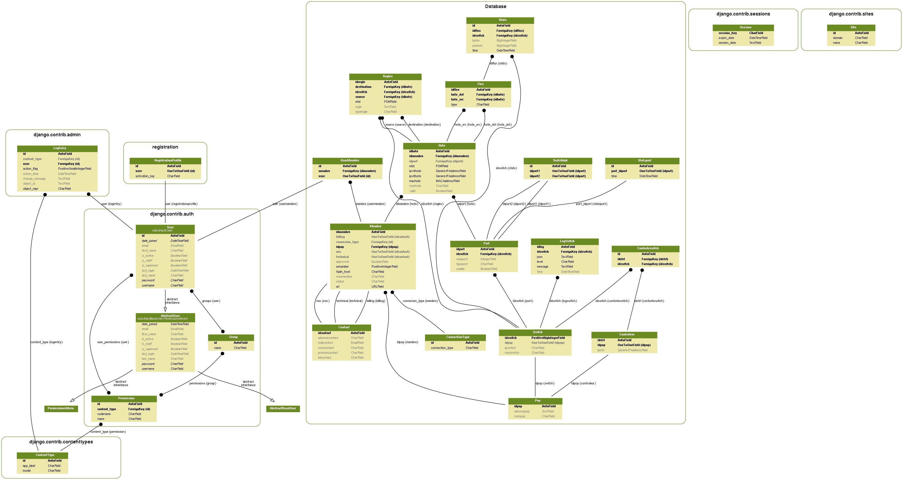
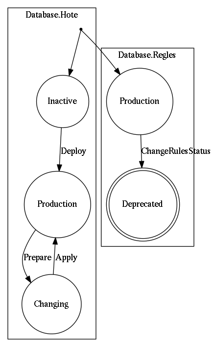

Administration
==============

Philosophy
----------

The management of your IXP with this tool look like pretty much avy Django app.
We didn't want to break the base framework completely to provide our solution.
It is handled like a classic Django project, and many efforts have been provided to do this project "the Django way".
Thus, Django generic apps developed by the community will work on this project (especially on the Model side).

Nevertheless, some automation have been provided directly on the admin side of the app to facilitate workflow and reduce human error.

So basically, you can interact with any type of model created in the database.
Editing all the objects saved can be done via the admin interface.

But upon adding/removing/modifying certain elements, you will be faced to side-effects (like the :ref:`state-machine`).
All of these special cases will be detailed on this page.

.. _database-model:

Database model
--------------

Create/delete objects
---------------------

The creation and deletion of model objects in TouSIX-Manager is the same for other Django apps.
The forms are adapted on the needs for an administrator, and there is no particular difficulties to handle it.
We will describe each form used in TouSIX-Manager:

* Connection type
    Here you define the list of connection types available for the members who want to connect on your IXP.

* Members
    This represent a member of your IXP. It is not represented by a physical person (for this, see :ref:`contact`).
    The model is the core object for linking all the informations about a member (hosts, contacts).

.. _contact:
* Contact
    This is a list of contacts filled by the members. You can retrieve some information on physical person for some purposes:

    * Billing
    * Technical
    * NOC

* Host
    A host can be a simple machine or a router, managed by TouSIX-Manager.
    The host will be considered part of the network if the valid option if the valid option is filled.
    Otherwise, the object would be only stored in the database, and its use is limited.
    Keep in mind the hosts objects are strongly linked to the network production.
    Any changes or deletion could have an impact on your topology.

* Log switch
    Contains logs sent by the controller via HTTP. Raw entry of these logs can be available in JSON format.

* PoP
    This model defines information on points of presence for the IXP.

* Switch
    This entry have all the switches declared for linking the members.
    Note that the network capabilities have not been defined on this model, but on the :ref:`port` model).

.. _port:
* Port
    Each model contains informations about port capabilities, and if the port is accessible for members.
    On some forms in the admin site, a pre-treatment is done for occupied ports.
    We consider one port can be occupied by one host only.
    If more ports is required for a single port, you need to perform a manual operation on the database to do so.

* Rules
    Hereby present all the rules applied in the topology.
    Other than the JSON rule, additional fields are present to make easier the identification of the rule.
    Direct modification of a rule is not advised for automation.
    You must considerate first adding/removing rules on the database to keep integrity with the controller.

Actions
-------

Admin actions are available to help on handling some database and production operations.

tousix_manager.Administration.actions.generate_routeserver_conf
Generate the route server configuration and apply it to the BGP server.
Usually, foe each new member validated, it will be done automatically.
But if you have some issues with the appliance on the server, or just want to clean the config files, this action is here to do the job.

tousix_manager.Administration.actions.generate_openflow_rules
Relaunch the rules generation procedure.

tousix_manager.Administration.actions.get_rules_list
Display all the OpenFlow rules available in the database in JSON format.

tousix_manager.Administration.actions.change_hote_status
You can change the state of one or multiple hosts (from Changing to Production, or the other way) with this action.
All the transitions will be executed for each host.

tousix_manager.Administration.actions.apply_hote_on_production
This action enforce selected host configuration into the topology.

.. _state-machine:

State-machine
-------------

There are some side-effects which can occur when an administrator or a user modify host values.
These modifications are ruled by a state machine defined in TouSIX-Manager model.

The life cycle of the state machine is defined in this schema:

Let's decrypt Model status for the host:

    The inactive state is used to create the Host object, but not apply it in the production.
    It requires an admin action to get out of this state, and apply the Deploy transition method.

    The production state guarantee the actual object saved in the database is applied exactly on the production.
    If some important modification occurs on the object,
    TouSIX-Manager will apply the modifications provided, and keep the ancient configuration in production (via the Prepare transition method).

    Changing state for a host means he could be on two states.
    This limbo state is used to let the member doing his part of the modification (hardware or software).
    When this is done, the administrator can apply the Apply transition method to remove the old configuration.

A state machine is also applied for the Rules model.
Its purpose is for make  the maintenance (by a human or a program) easier.
It separates the actual rules needed to run the topology, and the ones which will not be useful later.