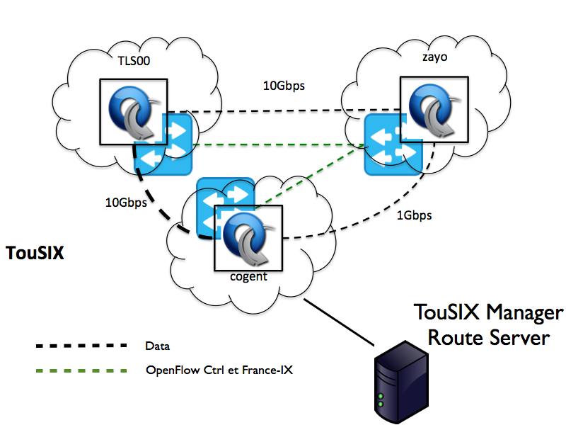
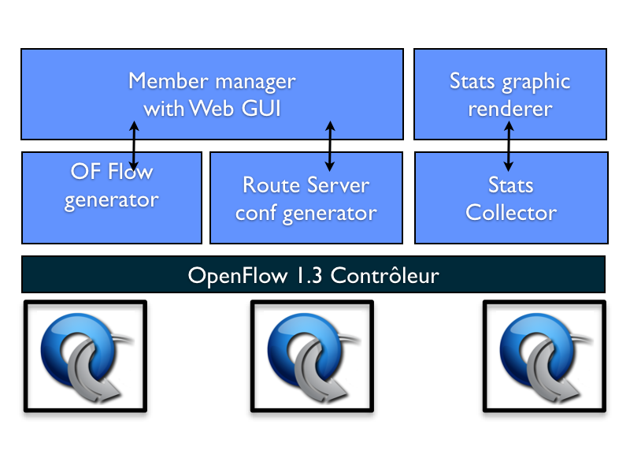

Overview
--------

The name TouSIX comes from Toulouse SDN Internet eXchange.

The TouSIX-Manager is an Python application to run with ryu-manager and Django framework for automating openflow generation and BIRD router server configuration.

An statistic collector and web graphic renderer it also present allowing the IXP member to visualized in details the amount of traffic exchanged  with their peers.

The TouSIX-Manager has been designed to run on the Toulouse Internet eXchange at the beginning and could be easily extended to run Umbrella Fabric on other IXP topology.

The figure below show the actual TouSIX deployment with 3 PoPs with each an Pica8 P-3290 and separated OpenFlow control channel network. Any OpenFlow 1.3 switch hardware or software could be used in theory.

TouSIX is running in production with Pica8 whitebox OpenFlow switch with PicOS 2.6 in OpenVSwitch mode. We have chosen PicOS 2.6 because it is able to maintain the last OpenFlow table state even after a reboot or a power outage even is there is no OpenFlow controller reachable.

Software architecture
---------------------

